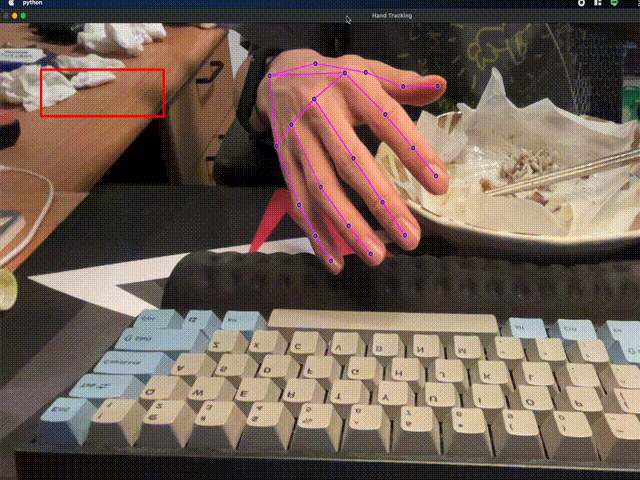

# 2022-HCI-Homework

人機互動作業上傳紀錄

## Demo - Background Subtraction version


### Background Subtraction

MOVEMENT_THRESHOLD = 50
利用擷取畫面中的按鈕（red block）範圍內的 Background Substraction 來達成偵測是否有接觸到按鈕，並且動態調整藍色方塊數量（blue block）。

### Build

```
cd hw4 && make
```

### Env

required: 
* c++ 11
* opencv 4.6.0

tested on:
* macos monterey 12.5 (arm)


## Demo - Gesture Recognition version


### Gesture Recognition

使用 mediapipe 的 hand detection 來偵測手部的位置，並且利用手部的位置來判斷是否有接觸到按鈕。

### Run

```
python hw5.py
```

### Env

required: 
* python 3.9
* opencv 4.6.0
* mediapipe

tested on:
* macos monterey 12.5 (arm)